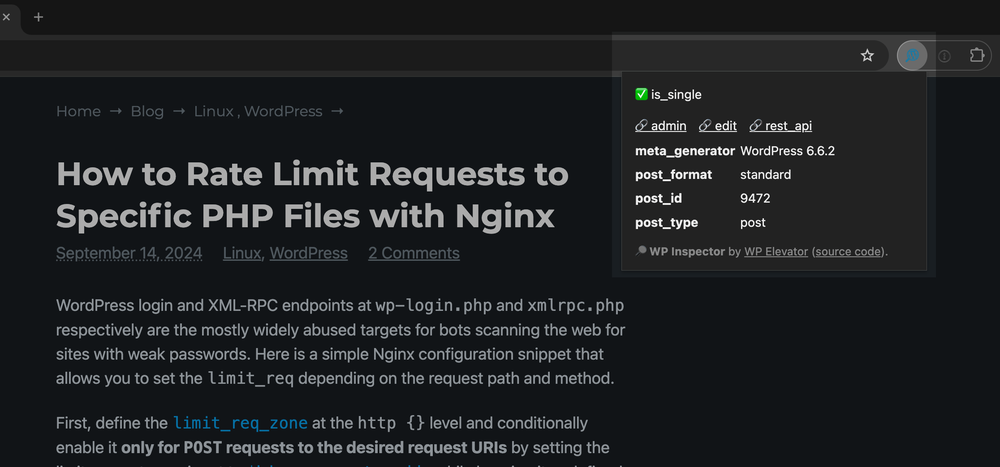

# WP Inspector Browser Extension

The quickest way to discover post IDs, page templates and view types for any WordPress site. Works by mapping known WordPress HTML element classnames.

> [!IMPORTANT]
> This is still a prototype!

## Notes

- Uses the latest [`activeTab`](https://developer.chrome.com/docs/extensions/develop/concepts/activeTab) and [`scripting`](https://developer.chrome.com/docs/extensions/reference/api/scripting) extension permissions to limit access to site source code only when the extension is active.

## To Do

- [ ] Use `prefers-color-scheme` media query to adjust the popup styling.

## Credits

Created by [Kaspars Dambis](https://kaspars.net), see [this tweet](https://x.com/konstruktors/status/1835320136720392301).
